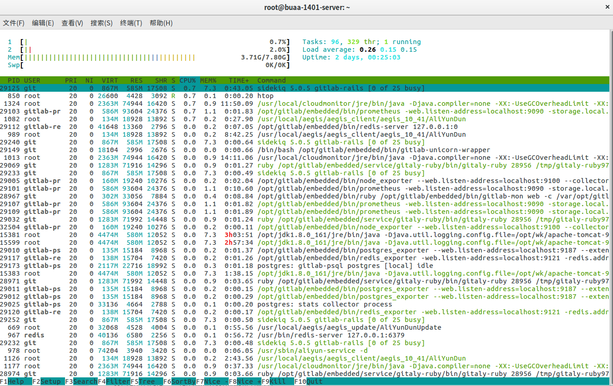

# linux常用命令

@TODO Mysql 默认安装后的用户是? root,怎么切换成最小用户

* [vim](#vim)
* 文件操作
    * [压缩与解压](#压缩与解压)
    * [文件目录操作]()

* 远程操作    
    * [远程登录操作](#远程登录操作)
    * [文件上传与下载](#文件上传与下载)
    * [ssh免密码登录](#ssh免密码登录)
    
* 权限相关
    * [切换用户](#切换用户)
    * [权限操作]()    
    
* [其他操作](#其他操作)
    * [查看性能](#查看性能)
    * [命令行下访问http](#命令行下访问http)
    * [判断tomcat是否启动](#判断tomcat是否启动)
    * [常见的linux命令](#常见的linux命令) 

 

## vim 

> 基本操作

* 复制
    * 单行复制
        * 在命令模式下，将光标移动到将要复制的行处，按“yy”进行复制；
    * 多行复制
        * 在命令模式下，将光标移动到将要复制的首行处，按“nyy”复制n行；其中n为1、2、3……
    * 粘贴
        * 在命令模式下，将光标移动到将要粘贴的行处，按“p”进行粘贴         

* 删除
    * dd:删除游标所在的一整行(常用)
    * d1G:删除光标所在到第一行的所有数据
    * dG:删除光标所在到最后一行的所有数据
    * d$:删除光标所在处，到该行的最后一个字符
    * d0:那个是数字0,删除光标所在到该行的最前面的一个字符
    * [其他不常用](https://blog.csdn.net/chenyoper/article/details/78260007)

> 参考文档

## 文件操作

### 压缩与解压

> 基本操作

    #解压
    tar zxvf FileName.tar.gz
    
    #压缩
    tar zcvf FileName.tar.gz DirName    

> 参考文档

* [Ubuntu下各种压缩与解压的方式小结](http://www.jb51.net/article/112207.htm)

## 远程操作  

### 远程登录操作

    ssh -l root -p 1422 47.92.0.57

### 文件上传与下载

> 基本操作

    #文件上传 #将本地文件,通过1422端口上传到服务器上
    scp  -P 1422  -r /opt/jdk1.8.0_161.tar.gz  root@47.92.10.57:/opt/

    #文件下载 将远程服务器的readme下载到本地
    scp   -P 1422 -r root@47.92.10.57:/opt/readme.txt ./

> 参考文档

* [ubuntu SSH 连接、远程上传下载文件](https://www.cnblogs.com/qinduanyinghua/p/7152812.html)
* [scp命令需要指定端口时要紧跟在scp后](https://www.cnblogs.com/jixingke/p/6213074.html)

### ssh免密码登录

> 教程：[linux实现ssh免密码登录的正确方法](https://jingyan.baidu.com/article/c275f6ba08267ae33c756758.html)

    注意点，由于端口改变了，copy时，需要指定端口：
    ssh-copy-id -i ~/.ssh/id_rsa.pub -p 1422 root@47.92.1.57

## 权限相关

### 切换用户

    #切换到root
    su
    #退出root 
    exit 

> 参考资料

* [ubuntu中root和普通用户切换](https://blog.csdn.net/u011484045/article/details/52108692)

## 其他操作

### 查看性能

* 通过 htop命令

### 命令行下访问http

    w3m www.baidu.com

* [linux 命令行模式下，浏览网页方法](https://blog.csdn.net/qq_35346390/article/details/76066326)

### 判断tomcat是否启动

    ps -ef |grep tomcat

### 常见的linux命令

* [常见命令](https://zhidao.baidu.com/question/919345359486228339.html)
