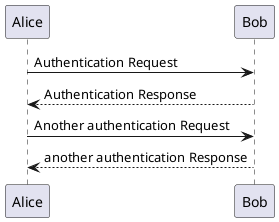

# 数据库操作技巧

>目录

* [多数据库源配置](#多数据库源配置)
* [代码自动生成](#代码自动生成)
* [分页插件](#分页插件)
* [Mybatis缓存的应用](#mybatis缓存的应用)
* [单表动态查询](#单表动态查询)
* [多表关联查询](#多表关联查询)
* [druid使用技巧](#druid使用技巧)

 

> 下面是我自己实验的UML例子

```puml
@startuml
Alice -> Bob: Authentication Request
Bob --> Alice: Authentication Response

Alice -> Bob: Another authentication Request
Alice <-- Bob: another authentication Response
@enduml
```
