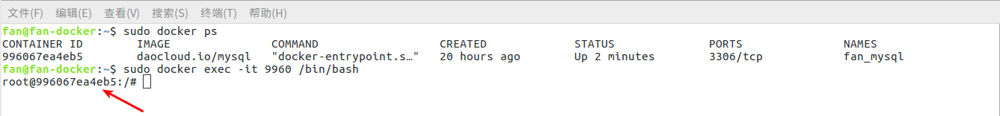

# docker 基本用法

> 名词解释


名称 | 说明 |
--------- | --------|
docker  | docker管理平台 |
镜像    | 可安装或恢复的包，例如windows上用gohst生成iso文件 |
容器    | 镜像安装后可以运行的独立环境，类似于虚拟机。 |


<br>

> 目录


* [安装docker](#安装docker)
* [安装镜像](#安装镜像)
    * [安装gitlabrunner](#安装gitlabrunner)
    * [安装mysql](#安装mysql)
* [登录容器](#登录容器)    
* [生成镜像](#生成镜像)
* [搭建私有镜像服务器](#搭建私有镜像服务器) 
* [备份或删除容器](#备份或删除镜像)
* [docker常用命令](#docker常用命令)   
* [docker高级用法](#docker高级用法)
* [常用网址](#常用网址)


## 安装docker

> 一键安装(需要三步)

```youtrack
##下载并安装docker
curl -sSL https://get.daocloud.io/docker | sh 

##修改docker镜像地址，官方的镜像库连接太慢，这里转到daocloud镜像库。 
curl -sSL https://get.daocloud.io/daotools/set_mirror.sh | sh -s http://91c0cc1e.m.daocloud.io 

## 启动docker服务，并设置开机启动 
systemctl enable docker.service && service docker start
```

* [参考网址：用国内地址一键安装docker](https://blog.csdn.net/dante_003/article/details/70208908)
* [docker常用命令总结之安装、镜像、容器基本操作](http://www.jb51.net/article/113227.htm)
* 在下载并安装docker前，我设置下载镜像是清华，不设置也行，就是速度慢。
* 在执行最后一步，自启动前，如果第二步有提示，可以按照提示操作一下。


> 验证是否安装

* 输入：docker --version
* 显示：Docker version 18.05.0-ce, build f150324


## 安装镜像

> 镜像市场

* [daocloud](https://www.daocloud.io/)


### 安装mysql

> 安装

* 访问国内镜像市场：http://hub.daocloud.io
* 搜索并找到mysql: http://hub.daocloud.io/repos/fa51c1d6-9dc2-49d9-91ac-4bbfc24a1bda
* 查看这个页面的帮助，并找到[启动一个 mysql 服务实例]，实际就是安装mysql
    * $ docker run --name some-mysql -e MYSQL_ROOT_PASSWORD=my-secret-pw -d daocloud.io/mysql:tag
* 在我自己的机器，我修改了上面的命令
    * $ docker run --name fan_mysql -e MYSQL_ROOT_PASSWORD=rootmysql -d daocloud.io/mysql:tag    


    
## 登录容器

> 以登录到fan_mysql容器为例

* sudo docker ps   #显示已经安装的docker容器 
    * 如果没有显示，那么使用 ps -a 显示没有启动的容器
    * sudo docker ps start fan_mysql  启动容器


* sudo docker exec -it 9960 /bin/bash #登录到容器中
    * 小技巧，输入编号的前4位，也可以找到容器
    
 


* 在容器中可以使用大部分linux命令，例如下图登录到mysql中

 


