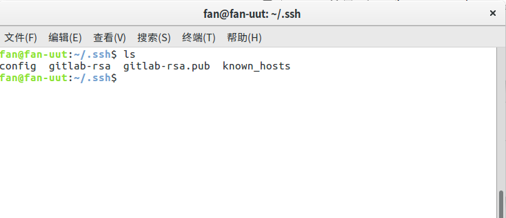
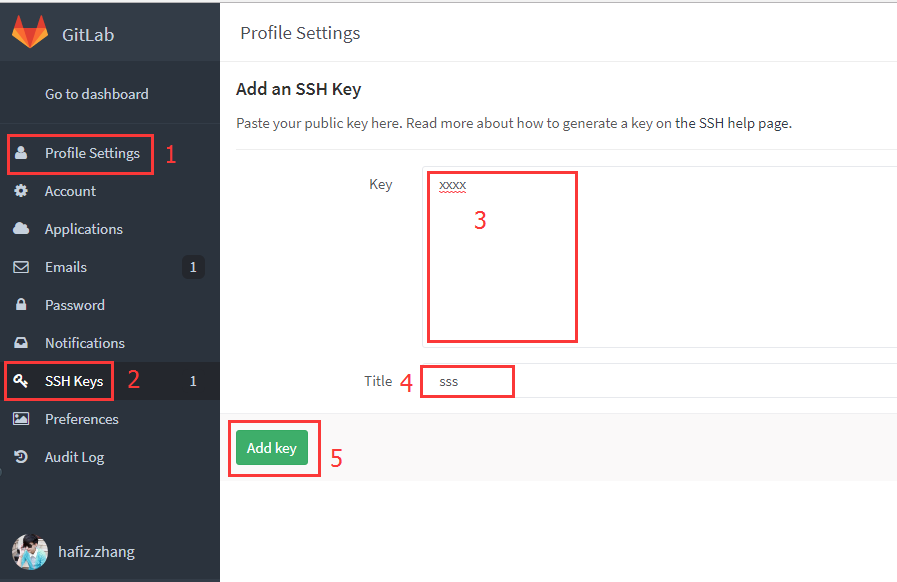
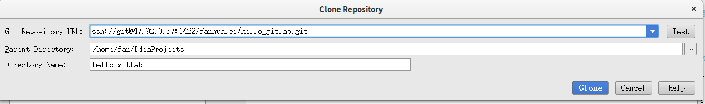
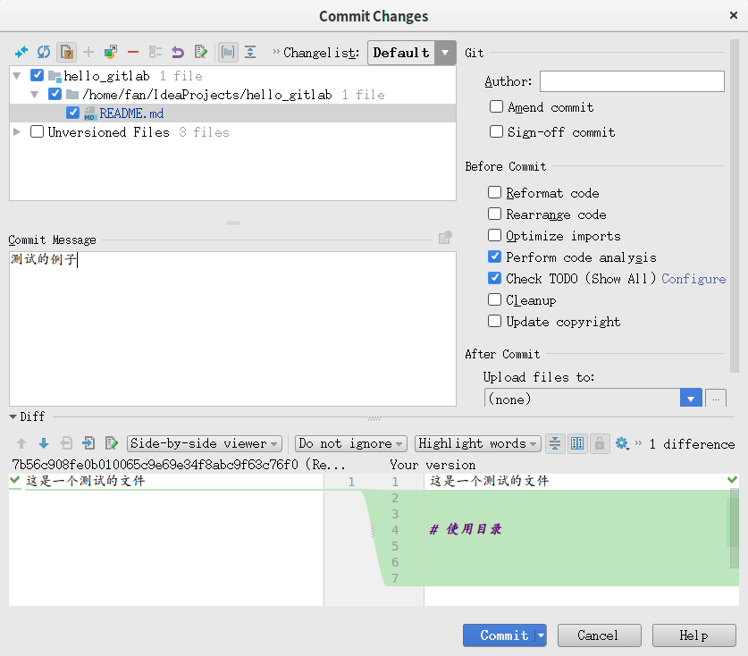
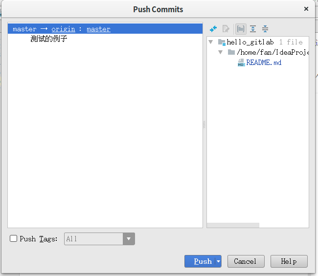
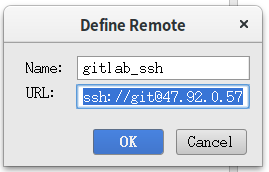

# 使用gitLab提交代码


> 注意

* 本页中图片的ip后台都修改成了域名。因为时间原因，没有更换图片。
* 刚开始gitlab没有域名，所以用ip访问，但是造成了ssh远程登录的冲突。
* 后来配置完域名后，就没有这个问题了。

<br>

> 目录


* [gitLab基本用法](#gitlab基本用法)
    * [设置ssh_key](#设置ssh_key)
    * [在gitlab设置key](#在gitlab设置key)
    * [建立工程从服务器](#建立工程从服务器)
    * [idea中可以提交github也可以提交gitlab](#idea中可以提交github也可以提交gitlab)
    * [gitlab与github代码冲突解决](#gitlab与github代码冲突解决)
    * 在小乌龟中配置git
    * [Idea中如何使用Git的基本操作](https://blog.csdn.net/shujiekeji/article/details/73896355)
    


    
    
    
## gitlab基本用法


### 设置ssh_key

> 使用ssh提交代码，比较安全

#### 主要步骤

##### 设置SSH Key

* 为gitlab生成key
    
```youtrack
ssh-keygen -t rsa -C 'fanhl@189.cn' -f ~/.ssh/gitlab-rsa
```     
    
* 将gitlab-rsa.pub的内容复制到gitlab网站上
    
```youtrack
cat ~/.ssh/gitlab-rsa.pub
```

* 本机配置ssh　conf文件，见下面注释 (下面追加了按照域名配置)
    
```properties

Host gitlab.runzhichina.com
    HostName gitlab.runzhichina.com
    PreferredAuthentications publickey
    IdentityFile ~/.ssh/gitlab-rsa

``` 
   


        

##### 在gitlab设置key


需要到服务器上把ssh数值给设置进去




> 参考网址

* [GitLab配置ssh key](https://www.cnblogs.com/hafiz/p/8146324.html)
* [IDEA 配置多个SSH key](https://blog.csdn.net/xiaolyuh123/article/details/78352614)


### 建立工程从服务器

* 主要步骤

#### idea菜单File->New->Project From Version Control->Git

<br>

#### 输入SSH的git地址



<br>

#### 编辑代码后，选择commit




#### push提交到服务



<br><br><br>

### idea中可以提交github也可以提交gitlab

原先的工程在github上，现在需要既能提交github又能提交gitlab

上午还行，下午就不行了，难道是没有ｍｅｒｇｅ的问题？？？？

#### 在push时候，选择定义新的远程链接


#### 输入远程名称以及地址



#### 从gitlab服务器上取得url


### gitlab与github代码冲突解决

#### 背景

* 马同学提交了变更到gitlab上，但是我没有同步到本地。
* 我在本地变更了代码，然后提交到github上。
* 这时候，我往gitlab上提交代码出现错误。
* 我想从gitlab上pull代码下来也出现错误。

#### 解决方法

* 把本地代码删除
* 从github上获取一份新的代码(这个时候不能编辑本地的任何代码)
* 在本地pull gitlab上的代码，系统会自动merge。
* 然后就可以往gitlab上push代码
* 然后就可以往github上push代码


