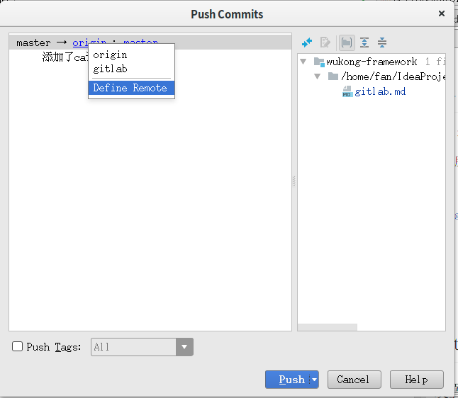
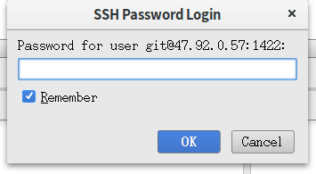

# gitLab

> 目录


* [gitLab基本用法](#gitlab基本用法)
    * [设置ssh_key](#设置ssh_key)
    * [建立工程从服务器](#建立工程从服务器)
    * [idea中可以提交github也可以提交gitlab](#idea中可以提交github也可以提交gitlab)


* gitLab高级用法
    * todoList    
    * ci持续集成
    * uml集成
    * wiki

* gitlab安装与配置
    * 安装
    * 安全配置
    
    
    
## gitlab基本用法


### 设置ssh_key

使用ssh提交代码，比较安全

> 主要步骤

* 设置SSH Key
    * 为gitlab生成key
        * ssh-keygen -t rsa -C 'fanhl@189.cn' -f ~/.ssh/gitlab-rsa
    * 将gitlab-rsa.pub的内容复制到gitlab网站上
        * cat ~/.ssh/gitlab-rsa.pub
    * 本机配置ssh　conf文件，见下面注释

```properties
# gitlab
Host 47.92.0.57
    HostName 47.92.0.57
    PreferredAuthentications publickey
    IdentityFile ~/.ssh/gitlab-rsa


# github
#Host github.com
#    HostName github.com
#    PreferredAuthentications publickey
#    IdentityFile ~/.ssh/github_id-rsa

# 配置文件参数
# Host : Host可以看作是一个你要识别的模式，对识别的模式，进行配置对应的的主机名>和ssh文件
# HostName : 要登录主机的主机名
# User : 登录名
# IdentityFile : 指明上面User对应的identityFile路径

```    


        


> 参考网址

* [GitLab配置ssh key](https://www.cnblogs.com/hafiz/p/8146324.html)
* [IDEA 配置多个SSH key](https://blog.csdn.net/xiaolyuh123/article/details/78352614)


### 建立工程从服务器

* 主要步骤

> idea菜单File->New->Project From Version Control->Git

<br>

> 输入SSH的git地址


<br>

> 编辑代码后，选择commit


> push提交到服务


<br><br><br>

### idea中可以提交github也可以提交gitlab

原先的工程在github上，现在需要既能提交github又能提交gitlab

上午还行，下午就不行了，难道是没有ｍｅｒｇｅ的问题？？？？

> 在push时候，选择定义新的远程链接




> 输入远程名称以及地址


> 从gitlab服务器上取得url


> 点击［ＯＫ］按钮后，会让输入密码

   