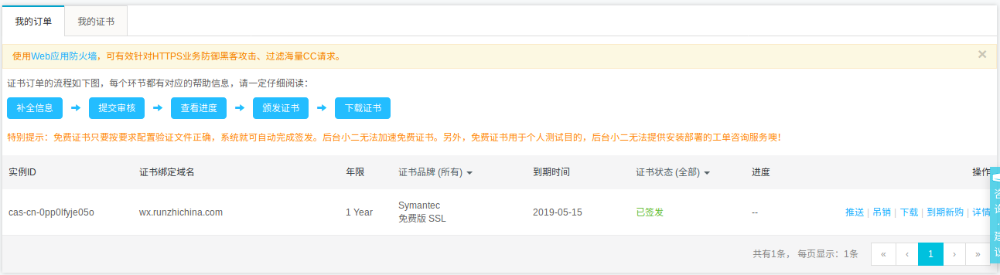
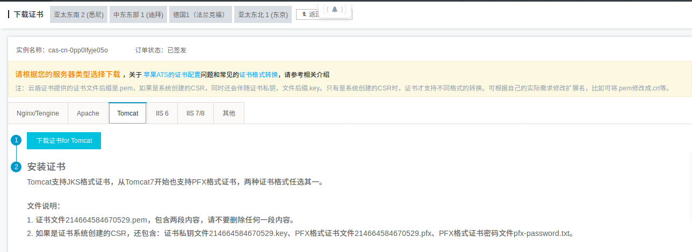
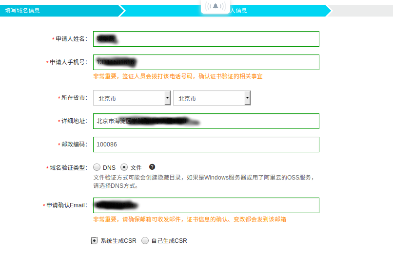

# https 相关操作

> [免费CA证书申请](#免费ca证书申请)

> [nginx+tomcat的https配置](#nginx+tomcat的https配置)

> [为gitlab申请https证书](#为gitlab申请https证书)

> [nginx从http跳转到https](#nginx从http跳转到https)


## 免费CA证书申请


> 步骤

* 在阿里提交证书申请，等待审批
* 下载专有验证文件fileauth.txt
* web根目录下创建.well-known/pki-validation子目录，将上面的文件放入
* 等待阿里审批
* 审批成功后



* 阿里提供了在不同服务器配置的方法



    

> 参考资料

* [如何在阿里云申请免费CA 证书](https://jingyan.baidu.com/article/4b07be3c92836148b380f318.html)


<br><br>

## nginx+tomcat的https配置


> 可选方案

* 方案一：nginx配置htts,tomcat不配
* 方案二：nginx与tomcat都配置https
* 选择方案一
* 参考资料(主要看我写的，网友的教程复杂了，实际上不用修改tomcat的内容)
    * [Nginx + Tomcat + HTTPS 配置原来不需要在 Tomcat 上启用 SSL 支持](https://blog.csdn.net/newtelcom/article/details/50782950)
    * [nginx https反向代理tomcat的2种实现方法](http://www.jb51.net/article/131766.htm)
    
    
> 具体步骤

>> 配置nginx的https

* 参考阿里的帮助文档

* (1)在Nginx的安装目录下创建cert目录,并且将下载的全部文件拷贝到cert目录中 
    * gitlab的nginx在/var/opt/gitlab/nginx
    * cd /var/opt/gitlab/nginx/
    * mkdir cert 
    * scp  -P 1422  -r ./nginx_ca.zip root@47.92.0.57:/var/opt/gitlab/nginx/cert/
    * unzip nginx_ca.zip
    * rm nginx_ca.zip

* (2)在/opt/wk/目录下建立一个wk_nginx_https.conf

```properties
server {
  listen 443;

  server_name wx.runzhichina.com;
  server_tokens off;

  ssl on;
  root html;
  index index.html index.htm;
  ssl_certificate   /var/opt/gitlab/nginx/cert/214664584670529.pem;
  ssl_certificate_key  /var/opt/gitlab/nginx/cert/214664584670529.key;
  ssl_session_timeout 5m;
  ssl_ciphers ECDHE-RSA-AES128-GCM-SHA256:ECDHE:ECDH:AES:HIGH:!NULL:!aNULL:!MD5:!ADH:!RC4;
  ssl_protocols TLSv1 TLSv1.1 TLSv1.2;
  ssl_prefer_server_ciphers on;

  location / {
    proxy_set_header   X-Real-IP $remote_addr;
    proxy_set_header   Host      $http_host;
    proxy_pass  http://127.0.0.1:20180;
  }
}
```    


    


* (3)nginx的安装目录下conf中建立wk_nginx_https.conf的软连接，并include
    
    * cd /var/opt/gitlab/nginx/conf 
    * ln -s /opt/wk/wk_nginx_https.conf ./
    * vim nginx.conf
   
```properties
# 文件的最后追加
include /var/opt/gitlab/nginx/conf/wk_nginx_https.conf;
```    
    
  
   
* (4)重启ginx
    * gitlab-ctl restart

* (5) 通过 https 方式访问您的站点，测试站点证书的安装配置。如遇到证书不信任问题，请查看[帮助视频](https://help.aliyun.com/video_detail/54216.html?spm=5176.2020520163.cas.42.2d7f2b7aU8zKEI)。   
    * http://wx.runzhichina.com/
    * https://wx.runzhichina.com/
    * https://wx.runzhichina.com/hello
    
    

## 为gitlab申请https证书


> 去阿里云申请https证书




> 首先确定gitlab的web根目录

* 进入 /opt/gitlab/embedded/service/gitlab-rails/public
* 建立一个fhl.html 文件
* http://gitlab.runzhichina.com/fhl.html 可以访问到


> 将阿里证书上传到服务器上 [参考](#免费ca证书申请)


> 配置gitlab-http.conf,可以由马宇航来操作。


## nginx从http跳转到https

### 配置文档

```properties
server {
  listen 80;
  server_name wx.runzhichina.com;
  server_tokens off;
  ## Don't show the nginx version number, a security best practice
  location / {
    return 301 https://wx.runzhichina.com$request_uri; 

    # 下面代码是用来通过80端口访问的
    # proxy_set_header   X-Real-IP $remote_addr;
    # proxy_set_header   Host      $http_host;
    # proxy_pass  http://127.0.0.1:20180;
  }
}
```

* 我是参考了gitlab的配置文件，使用了return 301 https://gitlab.runzhichina.com:443$request_uri;


> 参考文档
* [nginx从http跳转到https](https://www.cnblogs.com/nuccch/p/7681592.html)

