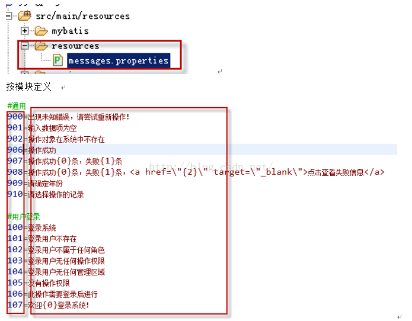

# 多语言 i18n

> 目录

* [核心目录](#核心目录)
* [基本用法](#基本用法)
* [key命名规则](#key命名规则)
* [参考资料](#参考资料)


## 核心目录

文件及目录 | 说明|
--------- | --------|
I18nConfig.java                 | extends  WebMvcConfigurationSupport 多语言配置文件 |
LanguageController.java         | controller类，有两个函数changeSessionLanauage与welcome|
application.properties          | 配置il8n文件|
il8n目录                        | messages文件：messages.properties messages_en_US.properties messages_zh_CN.properties|


> 默认是messages_zh_CN.properties ，只有在US与CN文件中找不到，才到这个文件找

### application.properties 配置内容

```properties
#设置国际化配置文件存放在classpath:/i18n目录下
spring.messages.basename=i18n/messages
#设定message bundles编码方式，默认为UTF-8
spring.messages.encoding=UTF-8
```

### 切换语言

    http://127.0.0.1:8080/welcome
    ## 输出：你好
    http://127.0.0.1:8080/changeLanguage?lang=en
    ## 切换到 英文
    http://127.0.0.1:8080/welcome
    ## 输出：welcome 

## 基本用法


### 通过messageUtil.getMessage()三种方法得到数据

 
* getMessage("key")
* getMessage("key{0}is{1}",Object[2])
* getMessage("key{0}is{1}",Object[2],"缺省字符串")

> 上面应该有四个函数，缺了一个，另外这个函数需要优化


```java
@Autowired
private LocaleMessageSourceUtil messageUtil;

@RequestMapping("/welcome")
public String welcome(){
    String welcome = messageUtil.getMessage("welcome");
    return welcome;
}


```


## key命名规则

当前有两种命名方法，一种用数字命名，一种用英文名字命名

### 数字命名法

    优势：命名简单
    缺点：通过名字不知道key的含义





### 英文命名法

    优势：在代码中，通过英文名，可以大概才到message的内容
    缺点：起名的时候化时间，英文不好，也看不懂


## 参考资料

* [github例子](https://github.com/zl736732419/spring-boot-i18n)