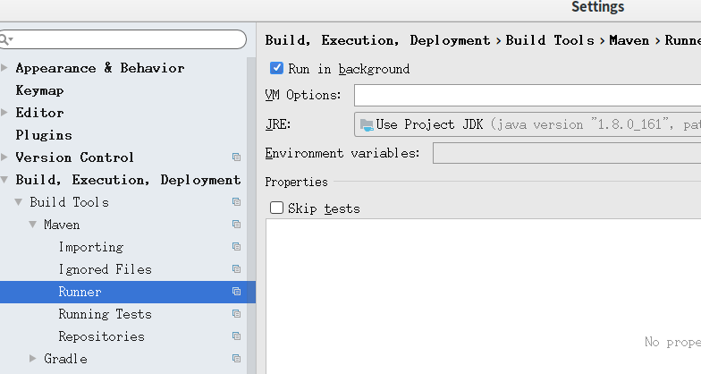

# maven 使用技巧

> 目录

* [如何在package中忽略test](#如何在package中忽略test)
* [参考文档](#参考文档)


## 如何在package中忽略test

> 方案一：修改idea的配置




> 方案二：修改maven配置文件(失败)

* 在根目录下的pom.xml 追加插件

```xml
    <build>
        <plugins>
            <plugin>
                <groupId>org.apache.maven.plugins</groupId>
                <artifactId>maven-surefire-plugin</artifactId>
                <configuration>
                    <skip>true</skip>
                </configuration>
            </plugin>
        </plugins>
    </build>
```


## 参考文档

* [史上最全的maven的pom.xml文件详解](https://www.cnblogs.com/hafiz/p/5360195.html)


