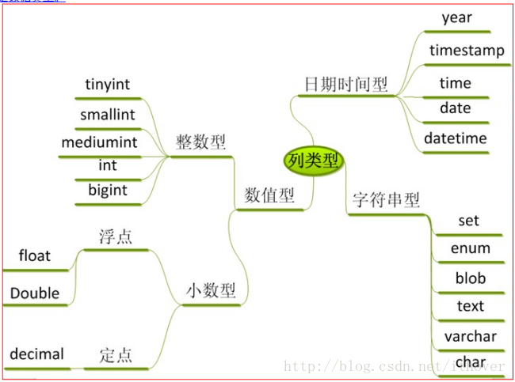

# Java与Mysql数据对应关系

> 目录


* 终结论
    * [程序中可用的数据类型](#程序中可用的数据类型)
    * [BigDecimal用法详解](#bigdecimal用法详解)

* 基础知识
    * [mysql的数据类型](#mysql的数据类型)
    * [java基本类型](#java基本类型)

* mybatis默认规则
    * [mysql转java](#mysql转java)


## 最终结论

#### 程序中可用的数据类型

为什么不用double与float呢？ 因为从小就定义成想阿里巴巴那样规模的交易量

> 为了计算方便，在java中使用Long Integer BigDecimal String Date

场景 |  mysql  | java   | 备注 |
--------- | --------| --------| --------|
主键      | BIGINT unsigned    |  long     |  权限管理模块，可以使用int类型 |
性别      | INT                | Integer  |   使用整形 |
是否      | INT               | Integer   |  不建议使用boolean 1 表示是，0 表示否|
年龄      | INT               | Integer   | 无符号值：0 到 255 |
金额      | decimal(15,4)     | BigDecimal| 禁止使用 float 和 double,如果存储的数据范围超过 decimal 的范围，建议将数据拆成整数和小数分开存储 |
经纬度    | decimal(10,7)     | BigDecimal| 小数点后7位  |
日期时间  | date time datetime| Date      | |


### bigdecimal用法详解

#### 构造器描述

    BigDecimal(int) 创建一个具有参数所指定整数值的对象。 
    BigDecimal(double) 创建一个具有参数所指定双精度值的对象。 
    BigDecimal(long) 创建一个具有参数所指定长整数值的对象。 
    BigDecimal(String) 创建一个具有参数所指定以字符串表示的数值的对象。
    
#### 方法描述

    add(BigDecimal) BigDecimal对象中的值相加，然后返回这个对象。 
    subtract(BigDecimal) BigDecimal对象中的值相减，然后返回这个对象。 
    multiply(BigDecimal) BigDecimal对象中的值相乘，然后返回这个对象。 
    divide(BigDecimal) BigDecimal对象中的值相除，然后返回这个对象。 
    toString() 将BigDecimal对象的数值转换成字符串。 
    doubleValue() 将BigDecimal对象中的值以双精度数返回。 
    floatValue() 将BigDecimal对象中的值以单精度数返回。 
    longValue() 将BigDecimal对象中的值以长整数返回。 
    intValue() 将BigDecimal对象中的值以整数返回。    

#### 格式化及例子

```java
public static void main(String[] args) {
    NumberFormat currency = NumberFormat.getCurrencyInstance(); //建立货币格式化引用 
    NumberFormat percent = NumberFormat.getPercentInstance();  //建立百分比格式化引用 
    percent.setMaximumFractionDigits(3); //百分比小数点最多3位 

    BigDecimal loanAmount = new BigDecimal("15000.48"); //贷款金额
    BigDecimal interestRate = new BigDecimal("0.008"); //利率   
    BigDecimal interest = loanAmount.multiply(interestRate); //相乘

    System.out.println("贷款金额:\t" + currency.format(loanAmount)); 
    System.out.println("利率:\t" + percent.format(interestRate)); 
    System.out.println("利息:\t" + currency.format(interest)); 
}
```

##### 结果显示

    贷款金额: ￥15,000.48 
    利率: 0.8% 
    利息: ￥120.00


#### BigDecimal比较

BigDecimal是通过使用compareTo(BigDecimal)来比较的，具体比较情况如下：

##### compareTo 

-1、0、1，即左边比右边数大，返回1，相等返回0，比右边小返回-1

##### 代码例子

```java
public static void main(String[] args) {
    BigDecimal a = new BigDecimal("1");
    BigDecimal b = new BigDecimal("2");
    BigDecimal c = new BigDecimal("1");
    int result1 = a.compareTo(b);
    int result2 = a.compareTo(c);
    int result3 = b.compareTo(a);
    System.out.println(result1);
    System.out.println(result2);
    System.out.println(result3);

}
```

#### BigDecimal.setScale 处理java小数点

    BigDecimal.setScale()方法用于格式化小数点
    setScale(1)表示保留一位小数，默认用四舍五入方式 
    setScale(1,BigDecimal.ROUND_DOWN)直接删除多余的小数位，如2.35会变成2.3 
    setScale(1,BigDecimal.ROUND_UP)进位处理，2.35变成2.4 
    setScale(1,BigDecimal.ROUND_HALF_UP)四舍五入，2.35变成2.4
    setScaler(1,BigDecimal.ROUND_HALF_DOWN)四舍五入，2.35变成2.3，如果是5则向下舍


> [BigDecimal用法详解](https://blog.csdn.net/u012150370/article/details/47114777)


## mysql的数据类型





### 整型

类型 |  所占字节  | 带符号最小值   | 无符号最小值 |带符号最大值 | 无符号最大值|
--------- | --------| --------| --------|--------|--------|
tinyint    | 1| -128                     | 0|127                 |255|
smallint   | 2| -32768                   | 0|32767               |622335|
mediumint  | 3| -8388608                | 0|8388607             |16777215|
int        | 4| -2147483648             | 0|2147483647（21亿）   |4294967295 （42亿）|
bigint     | 8| -9223372036854775808    | 0|9223372036854775807 |18446744073709551615|

> 定义方法
 
    //类型名【(长度)】  【unsigned】 【zerofill】
    tinyint(2) unsigned

### 小数 decimal

参数 |  用途  | 说明   |
---------  | --------| --------| 
decimal(15,4)  | 金额  | 千万亿 小数点4为|
date           | 日期  | 2018-06-01|
time           | 时间  | 12:59:59|
datetime      | 金额  | 1000-01-01 00:00:0|
varchar      | 金额  | 长度不要超过 5000|


* [MySQL数据库的基本数据类型](https://www.cnblogs.com/doctorJoe/p/5337510.html)


## java基本类型


### 基本类型详解

> 我们都知道Java的整形数据类型都是有符号的，并没有提供无符号数据类型。

类型 |  二进制位数  | 最小值   | 最大值   | 说明 | 
---------  | --------| --------|  --------|  --------| 
Byte      |  8  | -128                   | 127                   | 说明 | 
Short     | 16  | -32768                 | 32767                 | 3.2万 | 
Integer  |  32  | -2147483648            | 2147483647            | 21亿 | 
Long     |  64  | -9223372036854775808   | 9223372036854775807   | 19位 百万万亿 | 
Float   |  32   | 1.4E-45                | 3.4028235E38          | 很大 | 
Double  |  64   | 4.9E-324              |  1.7976931348623157E308| 很大 | 
char  |  16     | 0                     | 65535                  | 说明 | 

    Float和Double的最小值和最大值都是以科学记数法的形式输出的，
    结尾的"E+数字"表示E之前的数字要乘以10的多少倍。
    比如3.14E3就是3.14×1000=3140，3.14E-3就是3.14/1000=0.00314。

[Java的基本数据类型大小及其包装类](https://www.cnblogs.com/TTTTT/p/6541270.html)

### double与float补充说明

double 精度是15~16，能保证15，一般16位

float  精度为6~7位，能保证6位为绝对精确，7位一般也是正确的，8位就不一定了（但不是说8位就绝对不对了）


## mysql转java


### mysql的表结构


```sql
create table wk_field_type (
  field_type_id     bigint unsigned            NOT NULL AUTO_INCREMENT    COMMENT '用户id',

  tinyintf           tinyint        ,
  tinyint_unsignedf  tinyint unsigned,
  smallintf          smallint,
  smallint_unsignedf smallint unsigned,
  mediumintf         mediumint,
  mediumint_unsignedf mediumint unsigned,
  intf               int,
  int_unsignedf      int unsigned,
  bigintf            bigint         ,
  bigint_unsignedf   bigint unsigned,

  decimalf    decimal(15,4),
  varcharf     varchar(30),
  datef       date,
  timef       time,
  datetimef   datetime,
  PRIMARY KEY (field_type_id)
) ENGINE=InnoDB AUTO_INCREMENT=10000 DEFAULT CHARSET=utf8 COMMENT='测试类型数据表';
```


### 生成的java对象

```java
    private Long fieldTypeId;

    private Byte tinyintf;

    private Byte tinyintUnsignedf;

    private Short smallintf;

    private Short smallintUnsignedf;

    private Integer mediumintf;

    private Integer mediumintUnsignedf;

    private Integer intf;

    private Integer intUnsignedf;

    private Long bigintf;

    private Long bigintUnsignedf;

    private BigDecimal decimalf;

    private String varcharf;

    private Date datef;

    private Date timef;

    private Date datetimef;
```


