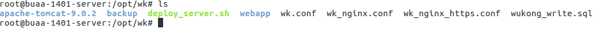

# 重要的shell脚本


> 目录

* [部署相关sh](#部署相关sh)
    * [上传文件脚本](#上传文件脚本)
    * [服务器自动部署shell脚本](#服务器自动部署shell脚本)


## 部署相关sh


### 上传文件脚本

#### 操作步骤

    * 上传文件
    * 远程执行文件

> 注意事项：远程执行脚本的时候，一定要cd 到脚本的目录，不然脚本中的相对路径会出现错误

#### shell脚本

````youtrack
#!/bin/bash


echo "hello world,I will deploy app to webserver !!!"

echo $1

scp -P 1422  -r $1 root@47.92.0.57:/opt/wk/

echo "==========upload file ok================="

ssh -l root -p 1422 47.92.0.57 "cd /opt/wk/; pwd ; ./deploy_server.sh"

echo "==========run server sh ok================="
````


### 服务器自动部署shell脚本


#### 操作步骤

    * 上传war到 /opt/wk
    * 停止tomcat
    * 备份原有的webapp程序 到 /opt/wk/backup目录
    * 删除原有的webapp目录下的两目录，但是index.html与version.html保留
    * 加压war到webapp
    * 备份war包
    * 将更新结果写入webapp/version.html
    * 重启tomcat





#### shell脚本

```youtrack
#!/bin/bash


./apache-tomcat-9.0.2/bin/shutdown.sh


#要求得到时间的名称    

datename=$(date +%Y%m%d_%H%M)
savefilename="backup/save_${datename}.zip"
echo $savefilename

echo -e "\r\n" >> webapp/version.html
echo   "================${datename} start===============<br>" >> webapp/version.html


#备份原有的程序

zip -q  -r $savefilename webapp

echo -e "\r\n" >> webapp/version.html
echo   "backup ok: ${savefilename} <br> " >> webapp/version.html


#删除原有的内容
rm -rf  ./webapp/META-INF/
rm -rf  ./webapp/WEB-INF/

#解压到webapp
unzip -q  wukong-donghai-1.1.RELEASE.war -d webapp/

echo " " >> webapp/version.html
echo   "deploy ok: wukong-donghai-1.1.RELEASE.war <br> " >> webapp/version.html


#备份安装包
mv  wukong-donghai-1.1.RELEASE.war  backup/wukong-donghai-1.1.RELEASE${datename}.war

echo " " >> webapp/version.html
echo   "delete wukong-donghai-1.1.RELEASE.war ok <br> <br>" >> webapp/version.html


#启动tomcat


echo " " >> webapp/version.html
echo   "----------------${datename} end----------------" >> webapp/version.html

./apache-tomcat-9.0.2/bin/startup.sh

```


