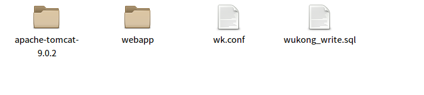

# 服务器安装规范

> 目录

* 规范
    * [端口规范](#端口规范)
    * [docker命名规范](#docker命名规范)
    * [tomcat工程目录规范](#tomcat工程目录规范)

* [当前服务器安装情况](#当前服务器安装情况)

## 端口规范

> 只有 ssh http https端口开发，其他端口外部不能访问。

端口 | 是否对外开放 | 说明| 
--------- | --------| --------|
22 | 是 |  ssh端口，已经修改成其他端口了 |
80 | 是 |  http nginx监听 |
443 | 是 |  https nginx监听 |
201** | 否 |  自定义服务的端口。 例如20180 被 wk 下tmocat使用 |
301** | 否 |  自定义docker服务的端口。 例如30180 关联某个docker的8080端口 |

## docker命名规范

### 组织名_项目名_组件名_版本号

    例如：
    wukong_gitlab_runner_1.0   # gitlab下的runner
    wukong_donghai_webenv_1.0  # 东海项目的web集成环境
    wukong_donghai_msyql_1.0   # 东海项目用到的mysql环境

## tomcat工程目录规范

### 例如一个叫wk工程，需要在opt下建立wk目录，然后防下列文件件

* apache-tomcat-9.0.2 tomcat的主目录
* webapp  用来放程序
* wk.conf 对应nginx的解析文件(docker中不需要)
* wukong_write.sql 放数据初始化文件

### tomcat引用的jdk放在opt目录中 jdk1.8.0_161

 

### docker工程安装步骤

* 以一个mysql 5.7.21(默认版本)为基础镜像来安装
* 安装redis
* 将jdk1.8.0_161 copy复制到容器的/opt下
* 将wk复制到容器的/opt下. wk下的tomcat端口已经是20180了
* 将主机的30180(或者)映射到该容器的20180
* nginx中的80根据域名，反向代理到30180
* 启动docker,以及里面的tomcat

