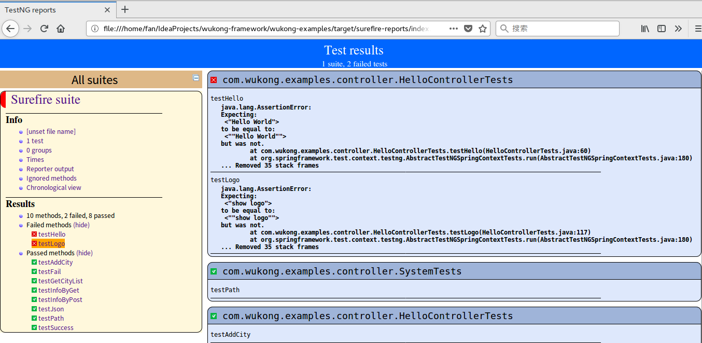

# TestNg使用指南

>目录

* [controller层测试](#controller层测试)
    * [如何引入Spring测试框架](#如何引入spring测试框架)
    * [如何模拟get测试](#如何模拟get测试)
    * [如何模拟post form测试](#如何模拟post form测试)
    * [如何模拟post json测试](#如何模拟post json测试)
    * [如何模拟上传文件测试](#如何模拟上传文件测试)
    * [如何判断http status是否成功](#如何判断http status是否成功)
    * [如何将http返回值转换成对象或json等格式](#如何将http返回值转换成对象或json等格式)

* [testNG基本语法](testng基本语法)
    * [如何使用断言利器AssertJ](#如何使用断言利器assertj)
    * [如何捕获预期异常](#如何捕获预期异常)
    
* testNG教程
    * [TestNG教程](https://www.yiibai.com/testng/)   
    * [TestNG GitHub网址](https://github.com/cbeust/testng/)
    * [SpringBoot 中文手册 --Part IV --41 测试](https://blog.csdn.net/bingfengzhihuo521/article/details/78615664)
    * [AssertJ官网教程](http://joel-costigliola.github.io/assertj/)
    * [assertThat用法大全](https://www.cnblogs.com/shangren/p/8039215.html)
    * [Junit4中的新断言assertThat的使用方法](https://blog.csdn.net/smxjant/article/details/78206435)
    * [assertThat详解](https://www.aliyun.com/jiaocheng/338365.html)
    
* [dao层测试](#dao层测试)
* [service层测试](#service层测试)
* [security模块测试](#security模块测试)

* [高级测试方法](#高级测试方法)
    * [参数测试](#参数测试)
    * [从excel表读取测试数据](#从excel表读取测试数据)
    * [通过注解进行冒泡测试](#通过注解进行冒泡测试)
    * [dataProviders参考网址](#https://github.com/sergueik/testng-dataproviders)
    
* [查看测试结果](查看测试结果)    
* [已经完成的测试脚本](#已经完成的测试脚本)        
   

## controller层测试

### 如何引入Spring测试框架

### 如何模拟get测试

### 如何模拟post form测试

### 如何模拟post json测试

### 如何判断http status是否成功

### 如何将http返回值转换成对象或json等格式

 

## testNG基本语法

### 如何使用断言利器AssertJ

[参考网址](https://blog.csdn.net/jacksonchina2008/article/details/79381658)
   
   
### 如何捕获预期异常   
   
   
   
   
   
## 查看测试结果

使用Maven执行测试后，到这个目录下打开html文件，可以看到测试脚本

    wukong-framework/wukong-examples/target/surefire-reports/index.html

 
 
 

