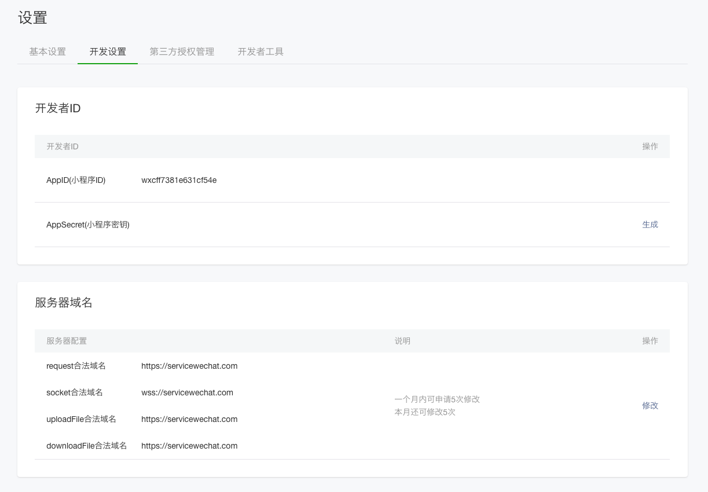

# 微信小程序开发


> 目录


* [程序配置](#程序配置)
* [服务器端配置](#服务器端配置)


## 程序配置

### 属性文件配置

```properties
#设置 开发者ID得到
wechat.miniapp.appid=wxf01a5b2fdsfsdf6sdddac36
wechat.miniapp.secret=9828e97sdsea827842e64csdfc

#设置 消息推送处得到
wechat.miniapp.token=tokentest
wechat.miniapp.aesKey=mDdddff6I4WDsdfLdddvzijCFddZB5CtLsdf
wechat.miniapp.msgDataFormat=XML
```

### 访问权限配置

```properties
#配置不受权限控制的url，将根目录与wechat下所有的权限放开
wukong.security.permiturls=/*,/wechat/**
```


## 服务器端配置

### 前提条件

* 有一个https的域名服务器，假设https://wx.ibm.com

* 把程序配好，并部署到服务器上

### 配置内容

> 登录到mp.weixin.qq.com

#### 开发者ID



#### 服务器域名

见上图

#### 业务域名

* 需要下载一个txt文件，上传到web服务器的根目录，然后才会成功
* 另外socket，需要配置成wss，听说使用443会有问题，等遇到问题，再解决


#### 消息推送

* 域名需要配一个地址：https://wx.ibm.com/wechat/portal

