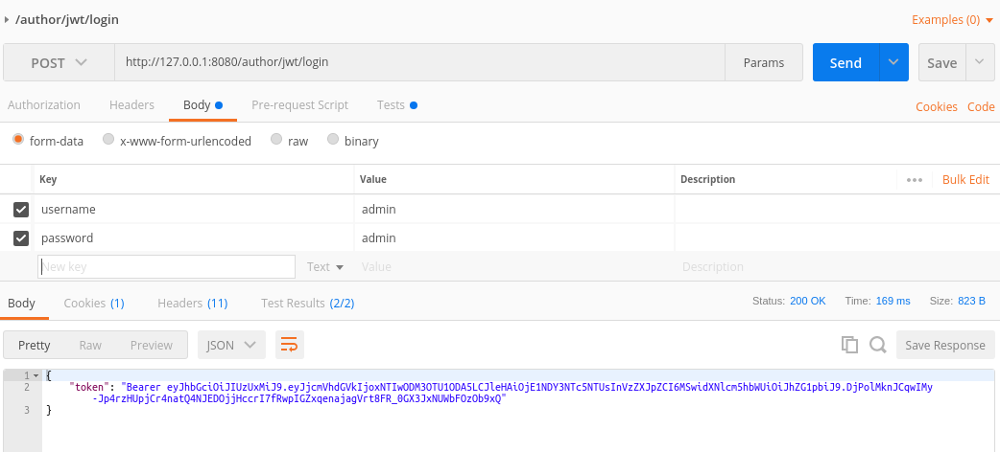
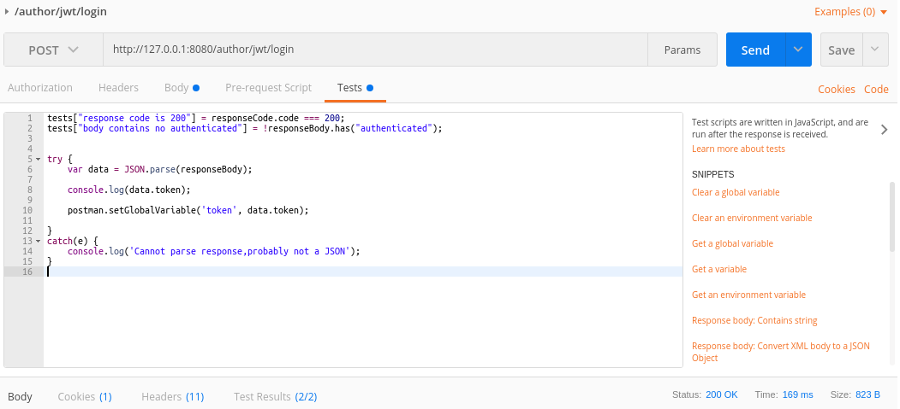
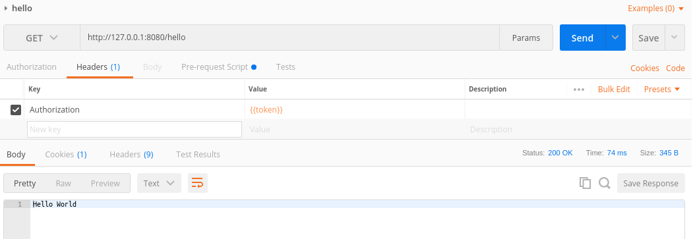
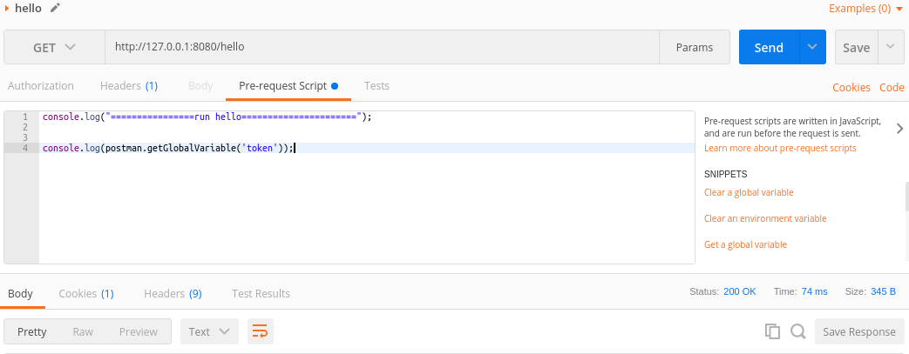
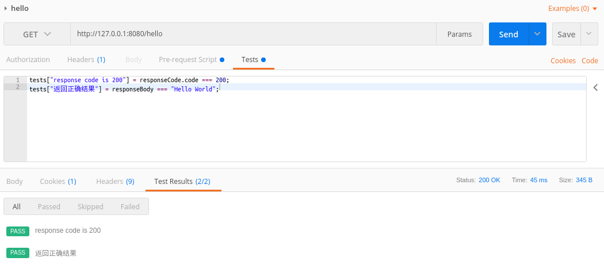

# 快速开始

本节只介绍,利用postman快速测试一个被安全防护的hello接口

`问题描述`  
直接访问 http://127.0.0.1:8080/hello,会出错.

> 目录

* [login](#login)
    * [配置login用户名密码](#配置login用户名密码)
    * [将token放入全局变量中](将token放入全局变量中)
* [HelloWorld](#helloworld)
    * [设置authorization](#设置authorization)
    * [设置调试代码](#设置调试代码)
    * [撰写测试用例](#撰写测试用例)
        
 

## login

通过login得到全局tonken
  
### 配置login用户名密码

 

### 将token放入全局变量中

> postman.setGlobalVariable('token', data.token);

 

## HelloWorld

### 设置authorization

 

### 设置调试代码

 

### 撰写测试用例

 